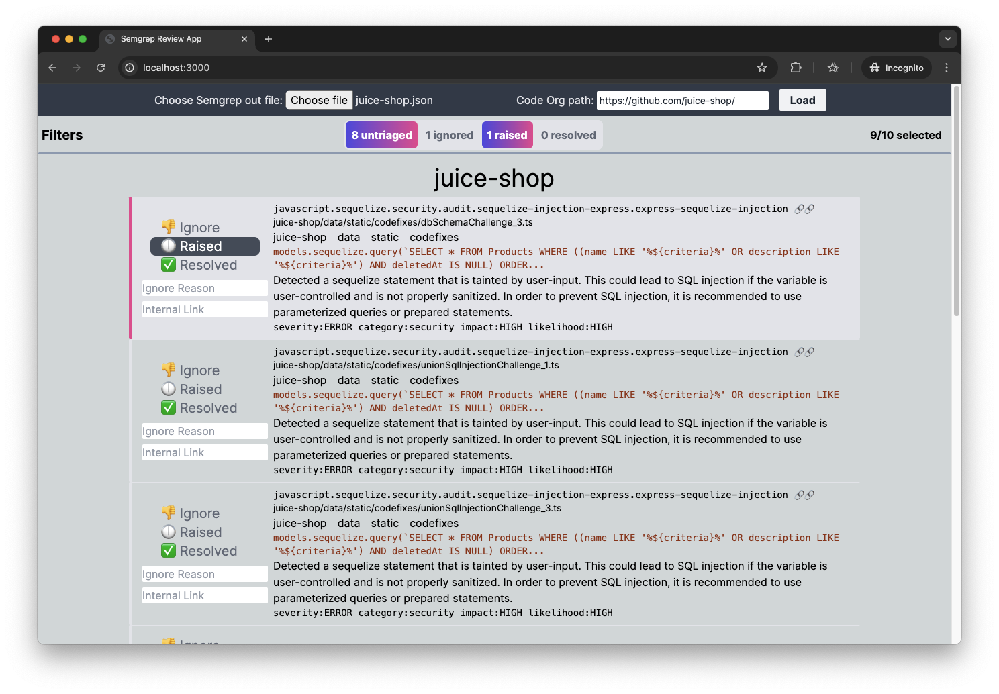

# Local Semgrep UI

This is a Next.js app to provide a UI to triage the JSON output of a Semgrep CLI scan.

Simply select Semgrep output JSON file in the UI to load it. Results are loaded from this file to Mongo DB for persistance and triage. The name of the file is used to construct group name in the probable Gitlab URLs when presenting the results for triage. Code org path is another input which is used to construct the links to the code in the issues.



## Pre-requisites

Following are the pre-requisites to be fulfilled before running the app:

1. Use [ghorg](https://github.com/gabrie30/ghorg) to quickly clone all repos in the target org locally
2. Run Semgrep CLI with a command like the following on the folder with the repos:

```bash
semgrep scan --config auto . --json >  marketing.json
```

### Configuration

- Update configurations in `app.config.js` file:
  - `ignoredCheckIds` - Semgrep check ids to be ignored since they are all insignificant or false positive
  - `ignoredPathsContaining` - Any issue with any of these strings in the path is ignored.

## Run the application

Run the application

1. Install dependencies with `npm install`
2. `npm run dev`

## TODO

1. Allow configuration for switching to Github (in addition to Gitlab) links
2. Move from Mongo to local file storage (SQLite?) to make execution easier - simply run the html bundle locally and save changes to the json file. This will likely require switching from Next.js to React.

## Security

### Risk profile

The application is experimental and intended to be run locally and hence does not cater to authentication or self XSS kind of scenarios. Ensure that it is always run on a local interface - 127.0.0.1 as opposed to 0.0.0.0.
